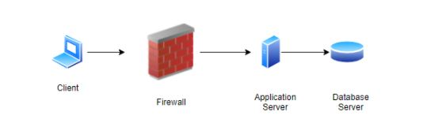
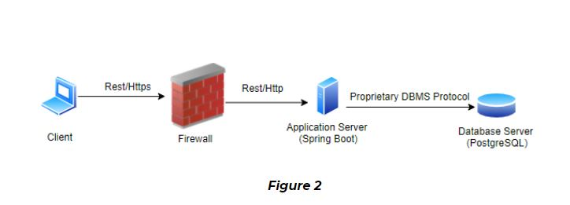
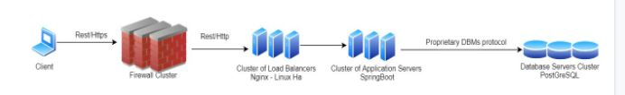
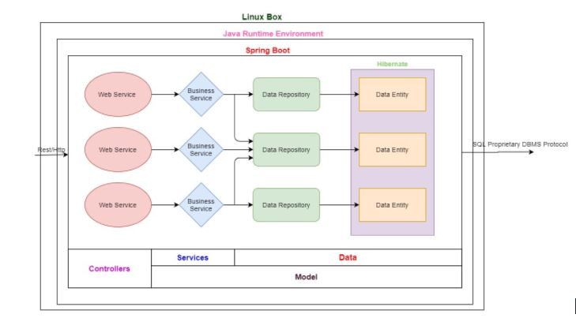

# REST-aurant-IT
## Overall Description
My project will revolve around the design and development of a restaurant Manager. The restaurant manager will have two types of users. An admin user and normal users. Admins should be able to run the application as their primary system. In other words, they should be able to manage their menu through the application, organize their table bookings, and generate receipts for their customers. Regular users should be able to look at the menu, and book a table online it is safe to conclude that this web application is composed of two modules. An admin module, and a user module. Both of the modules are linked and therefore update the same database.

## Requirements
### Functional Requirements

- **Roles / Actors**
  - There are two roles / types of actors: customer, admin
  
- **Customer Functionalities**
   - Customers shall be able to book a table by date and by time
   - Customers shall be able to have a look at the menu items as well as their price
   - Customers shall be able to update a booking
   - Customers shall be able to cancel a booking
 
- **Admin Functionalities**
  - Admins shall be able to print receipts for their customers
  - Admins shall be able to  access the history of their sales on a weekly basis
  - Admins shall be able to access the history of their sales on a monthly basis
  - Admins shall be able to cancel a table booking
  - Admins shall be able to add a table booking
  - Admins shall be able to update a table booking
  - Admins shall be able to add menu items
  - Admins shall be able to remove menu items
  - Admins shall be able to update the pricing of Menu items
  
### Non-functional Requirements

- **Performance**
  - The system shall allow the client to pass Google Lighthouse performance test with at least 80% 
  
- **Scalability**
  - The system shall scale *out* to preserve performance even when the load grows, at a reasonable cost
  
- **Security**
  - The confidentiality and integrity of all data traffic shall be protected
  - The authenticity of both the client and the server shall be ensured
  - Service high availability shall be ensured, i.e., no single point of failure (SPoF) shall be accepted
  
- **Extensibility**
  -If the owners of the restaurant want to extend to other locations, the system should support such a feature  

## Architecture
- **Physical Architecture - Initial**

  

The firewall will analyze incoming traffic based on pre-established security rules. The application server will host the application’s business logic. The database server will  store the data required to manage and effectively run the restaurant.
  

- **Physical Architecture - Protocols & Software**

   

The client will communicate with the firewall through the use of Rest and the HTTPS protocol, therefore all the packets sent by the client will be encrypted. The firewall will relay the request to the application server via the rest and http protocol.  The application server will run Spring Boot as a backend framework on top of the Java Runtime Environment.  Finally, the database server will consist of a PostgreSQL Database Management System.
  

- **Physical Architecture - Resilient (No SPoF) / Scalable**

  

As per the non-functional requirements of this project, the system should support high availability and must have no single point of failure. To satisfy these requirements, a cluster of firewalls, load balancers and application servers will be used. Another non-functional requirement that will be satisfied with this architecture is scalability. 

  

- **Logical Architecture - Inside an Application Server**

  

## Design
### Class Diagrams
- **Entity Class Diagram**

  

- **Repositories and Services Class Diagram**

  

### Sequence Diagrams
- **Data-driven Sequence Diagram**

  

- **Service-driven Sequence Diagram**

  

## Development
**Starting point**
- Clone this repository
- cd final
- ./gradlew build
- There you go!

**You need to install Docker, then run these commands**
- docker pull redis
- docker pull postgres
- docker run --name redis-container -p 6379:6379 -d redis
- docker run --name postgres-container -e POSTGRES_PASSWORD=postgres -p 5432:5432 -d postgres
- docker exec -it postgres-container psql -U postgres
- create database xcommerce
